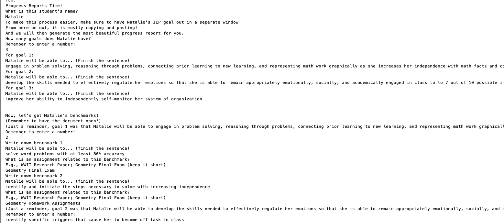

# Progress Reports
<table>
<tr>
<td>
Special Educators often need to generate hundreds of progress reports per progress reporting period (around once every three mounths) - however, this takes away from the important pieces of teaching: spending time teaching students. By streamlining this process, special educators may be better able to utilize their time in school, maximizing student potential. 
</td>
</tr>
</table>

<h3>First Draft</h3>

<h3>To Do</h3>
- [Create swing application]

<h4>Created By</h4>
Lesley C. 
 
